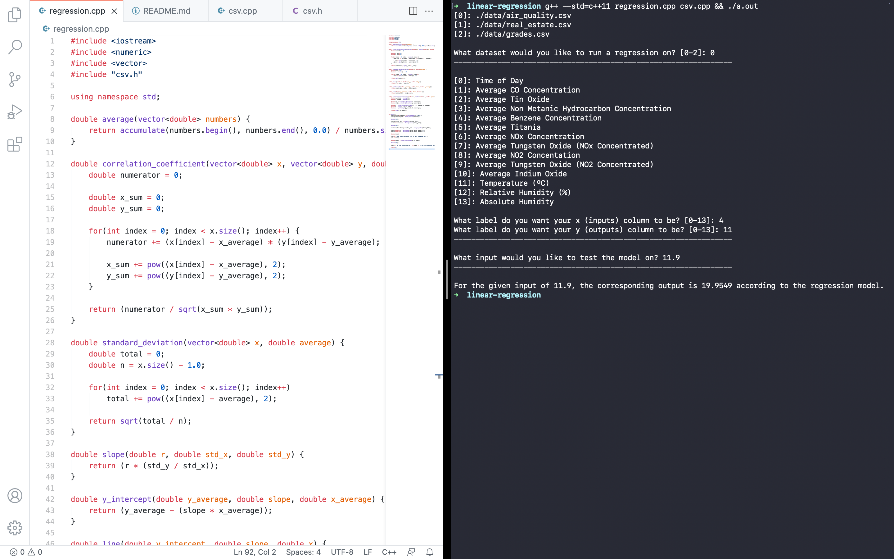

# Linear Regression Model

Upon researching computer science projects, creating a linear regression model stood out to me. I've dabbled with Neural Networks in the past, but I've never looked into the simpler artifical intelligence tools. I am taking AP Statistics during my senior year of high school so I thought this would be a fun way to get a little head start. I knew no statistics prior to this project but ended up learning a lot!

---

## Regression

In order to understand what linear regression was I needed to know what regression meant. The dictionary definition, according to Oxford Languages, states that statistical regression is:

> a measure of the relation between the mean value of one variable (e.g. output) and corresponding values of other variables (e.g. time and cost).

This sounded like a function to me—both in the mathematical and computer science terms—where given an input, there's a corresponding output. A regression model finds that relationship between the input (`x`) and output (`y`). Upon more research, I found that there were many different regression models such as ridge, lasso, and polynomial. However, for the sake of this project, I stuck with linear.

Linear regression is one of the simplest regression models. You're trying to find the `m` (slope) and `b` (y-intercept) values in the slope-intercept equation: `y = m + bx`. Some models also have an additional `e` value that measures the error: how wrong the guessed output is from the correct output. For the sake of my model, I did not do an error.

To understand the math behind the linear regression model, I watched [this explanation by Eugene O'Loughlin](https://www.youtube.com/watch?v=GhrxgbQnEEU). He walks through an example by hand. In fact, that's where the `grades.csv` dataset came from!

## Installation

To install this project either run `git clone https://github.com/brehanuasfaw/linear-regression linear-regression` in your terminal/command prompt or click the green `↓ Code` button up above. Once downloaded, navigate to your terminal/command prompt and navigate to the folder.

To compile and run the program, run: `g++ --std=c++11 regression.cpp csv.cpp && ./a.out`.

If you want to re-run the program, just run the output file: `./a.out`.

## Get Data

If you look in the `data` folder, you'll see three `.csv` datasets: `air_quality.csv`, `grades.csv`, and `real_estate.csv`. The datasets are comma-separated-value files (CSV) and are extremely simple. If you want to use your own dataset, download it as a CSV file and put it in the `data` folder. The program will look for the files in there. However, there are two pivotal rules for datasets:

1. The first line must have column names. The program looks for the first line and asks the user what column should be for the input, and what column should be for the output. Having column titles helps a lot for user experience.

2. Besides the first line, every data point must be a number. No text or any other data type is allowed. It will try to convert everything to a double, but if it fails, the program will halt.

*Note: the `air_quality.csv` dataset came from the [UCI Machine Learning Repository](https://archive.ics.uci.edu/ml/datasets/Air+quality#) and the `real_estate.csv` dataset came from [Kaggle](https://www.kaggle.com/quantbruce/real-estate-price-prediction).*

## Run the Model

To compile and run the program, run: `g++ --std=c++11 regression.cpp csv.cpp && ./a.out`.

If you want to re-run the program, just run the output file: `./a.out`.

Once the program starts, it will list out the datasets it has found along with numbers in square brackets. When prompted, type the number of the corresponding dataset you'd like to test the model on.

Next, it will list out the column names of the dataset you specified along with numbers in square brackets. When prompted, type the number of the corresponding column you'd like as inputs and the number of the corresponding column you'd like as outputs to test the model on.

Finally, it will ask you what input you'd like to test your model on. Once inputted, it will tell you the output.

**Note: All inputs *must* be numbers.**

## CSV Library

To make this program more interactive and user-friendly, I coded a simple CSV parser library. Working with files and parsing with C++ proved difficult, but I'm happy that it worked in the end.

*Please refer to `csv.cpp` if you want to see the functions, function information, and logic.*

## Regression Model

Pulling methods from `csv.cpp` (via the header file: `cpp.h`), `regression.cpp` additionally has its own functions to serve the model. The `main()` method ties everything together and utilizes the CSV functions.

*Please refer to `regression.cpp` if you want to see the functions, function information, and logic.*

## Contributions

Contributions are welcome and encouraged! This is by far not the most efficient program in the world but it is pretty speedy. If you know of a better way to read in files, by all means I'd be happy to incorporate it to the master branch and give you credit. Just submit a pull request!

## Conclusion

This project, while difficult, was a lot of fun. I've only done two other C++ projects (a [neural network](https://github.com/brehanuasfaw/C-NeuralNetwork) and [the Luhn algorithm](https://github.com/brehanuasfaw/luhn)) so the language is still pretty new to me. I got lots of experience working with strings this time and learned just how painful it can be opening a file and trying to parse through it.

Additionally, I understand linear regression and how it works from a mathematical standpoint.

C++ is hard, but incredibly rewarding in the end.